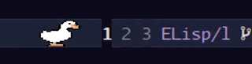

# emacs-pets

Animated virtual pets that live in your Emacs modeline. In GUI Emacs the pet is
rendered as a pixel-art XPM sprite; in terminal Emacs it falls back to a plain
Unicode character.

Inspired by [vscode-pets](https://github.com/tonybaloney/vscode-pets). Currently only
has a [duck](https://itch.io/queue/c/6987353/goose?game_id=3378290) lol. You can
easily add more pets, check the [Adding new pets](#adding-new-pets) section.

## Screenshots



## Requirements

- Emacs 25.1 or later
- XPM image support (built into most Emacs distributions) for pixel-art sprites

## Installation

### use-package (recommended)

To install straight from this repository with `straight.el`:

```elisp
(use-package emacs-pets
  :straight (:host github :repo "harrybournis/emacs-pets" :files ("*.el" "pets/*/*"))
  :demand t
  :config
  (emacs-pets-mode))
```

## Configuration reference

### Appearance

| Variable           | Default | Description                                                                                                                            |
|--------------------|---------|----------------------------------------------------------------------------------------------------------------------------------------|
| `emacs-pets-pet`   | `'duck` | Pet to display in the modeline. Currently available: `'duck`.                                                                          |
| `emacs-pets-scale` | `2`     | Sprite scale factor. Values ≥ 1 enlarge (each pixel becomes an N×N block). Values < 1 shrink via subsampling (e.g. `0.5` = half size). |

### Behaviour

| Variable                    | Default | Description                                                                                                 |
|-----------------------------|---------|-------------------------------------------------------------------------------------------------------------|
| `emacs-pets-tick-interval`  | `0.3`   | Seconds each animation frame is displayed. Controls walk speed and all state timing. Lower = faster.        |
| `emacs-pets-field-width`    | `22`    | Total character width of the pet display area in the modeline.                                              |
| `emacs-pets-step-size`      | `1`     | Columns moved on each walking frame. Fractions (e.g. `0.25`) move smoothly within a column.                 |
| `emacs-pets-idle-chance`    | `0.05`  | Probability (0–1) of entering idle state on each walking tick.                                              |
| `emacs-pets-idle-duration`  | `3`     | Number of seconds to stay idle before walking again.                                                        |
| `emacs-pets-sleep-chance`   | `0.005` | Probability (0–1) of entering sleep state on each walking tick.                                             |
| `emacs-pets-sleep-duration` | `60`    | Number of seconds to stay sleeping before walking again.                                                    |

#### Walk-cycle animation

```elisp
(setq emacs-pets-sprite-files '("/path/walk1.txt"
                                "/path/walk2.txt"
                                "/path/walk3.txt"
                                "/path/walk4.txt"))
```

List of files in frame order. Takes priority over `emacs-pets-sprite-file`. Frames advance on every walking step. The animation freezes on the current frame when the pet idles.

#### Idle animation

```elisp
(setq emacs-pets-idle-files '("/path/idle1.txt"
                              "/path/idle2.txt"))
```

Separate frames shown only while the pet is idle. Cycles on every tick. When the
pet resumes walking the idle frame resets to 0. If unset, the current walk frame
is shown during idle instead. 

#### Sleep animation

```elisp
(setq emacs-pets-sleep-files '("/path/sleep1.txt"
                              "/path/sleep2.txt"))
```

Separate frames shown only while the pet is sleeping. Cycles on every tick. When the
pet wakes up the sleep frame resets to 0. If unset, the first idle frame is shown
during sleep instead.

#### Colour map

```elisp
(setq emacs-pets-sprite-colors
      '("  c None"        ; space  → transparent
        ". c #000000"     ; dot    → black (outline)
        "o c #FF8C00"     ; o      → orange (body)
        "@ c #FFFFFF"))   ; @      → white (eye highlight)
```

Each entry is an XPM colour definition string. The first token (one or two
characters) is the pixel character used in the sprite file; the rest is the XPM
colour spec. This map is shared by `emacs-pets-sprite-file`,
`emacs-pets-sprite-files`, and `emacs-pets-idle-files`. 

### Sprite file format

Each line in a `.txt` sprite file is one pixel row. Lines may be different
lengths — shorter rows are padded with spaces automatically. Use the characters
defined in `emacs-pets-sprite-colors` (space for transparent, any other single
character for a colour). 

Example (`cat.txt`, facing left):

```
     ..
    .oo.
   .oooo.
  .oooooo..
 .oooooooo.
 .oo@@ooooo.
 ...
```

The right-facing image is generated automatically by mirroring the sprite
horizontally, so you only need to draw one direction. 

## Adding new pets

To add a new pet to emacs-pets:

1. **Create a pet directory**: Create a new directory under `pets/` named after your pet (e.g., `pets/cat/`).

2. **Add sprite files**: Place your sprite files in the directory following the naming convention:
   - `petname-walk-1.txt`, `petname-walk-2.txt`, etc. for walk cycle
   - `petname-idle-1.txt`, `petname-idle-2.txt`, etc. for idle animation
   - `petname-sleep-1.txt`, `petname-sleep-2.txt`, etc. for sleep animation

3. **Create pet definition file**: Create `pets/petname/emacs-pets-petname.el` with:

```elisp
;;; emacs-pets-petname.el --- Petname pet definition for emacs-pets

;;; Code:

(defconst emacs-pets-petname-walk-files
  (mapcar (lambda (f) (expand-file-name f (file-name-directory load-file-name)))
          '("petname-walk-1.txt"
            "petname-walk-2.txt"
            "petname-walk-3.txt"
            "petname-walk-4.txt"))
  "Walk cycle animation files for the petname pet.")

(defconst emacs-pets-petname-idle-files
  (mapcar (lambda (f) (expand-file-name f (file-name-directory load-file-name)))
          '("petname-idle-1.txt"
            "petname-idle-2.txt"))
  "Idle animation files for the petname pet.")

(defconst emacs-pets-petname-sleep-files
  (mapcar (lambda (f) (expand-file-name f (file-name-directory load-file-name)))
          '("petname-sleep-1.txt" "petname-sleep-1.txt" "petname-sleep-1.txt"
            "petname-sleep-2.txt" "petname-sleep-2.txt" "petname-sleep-2.txt"
            "petname-sleep-3.txt" "petname-sleep-3.txt" "petname-sleep-3.txt"
            "petname-sleep-4.txt" "petname-sleep-4.txt" "petname-sleep-4.txt"))
  "Sleep animation files for the petname pet.")

(defconst emacs-pets-petname-sprite-colors
  '("  c None"
    "= c #color1"
    ". c #color2"
    "* c #color3"
    "@ c #color4"
    "Z c #color5")
  "XPM color map for the petname pet.")

(provide 'emacs-pets-petname)
```

4. **Update documentation**: Add your pet to the `emacs-pets-pet` documentation.

5. **Test**: Set `(setq emacs-pets-pet 'petname)` and test your new pet!
